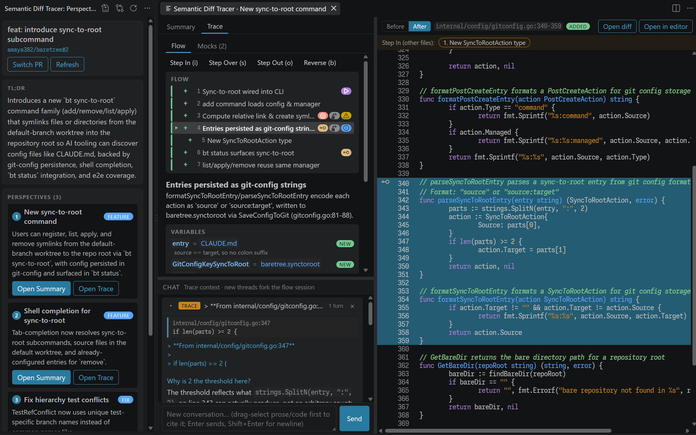
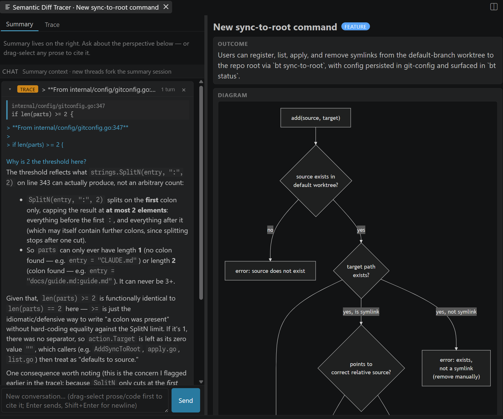
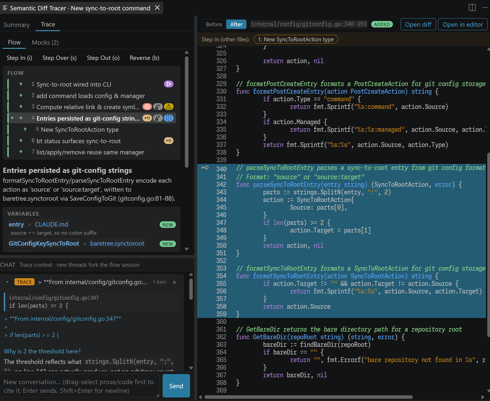

<p align="right"><strong>English</strong> / <a href="README_ja.md">日本語</a></p>

<h1 align="center">🧭 sdt: semantic-diff-tracer</h1>

<p align="center">
  <strong>Read a PR as a story, not as a wall of diff.</strong><br/>
  Groups changed hunks into outcome-based perspectives and lets you step through each one — without a debugger and without a runtime.
</p>

> [!WARNING]
> Experimental. Interfaces, commands, and prompts are still moving.
> See the [issues](https://github.com/amaya382/semantic-diff-tracer/issues) for known follow-ups and roadmap.

semantic-diff-tracer is a VSCode extension with a companion TUI CLI and a Claude Code skill (`trace-diff`) that emits a single-file HTML report. All three surfaces share the same core, so the perspectives, summaries, and traces are identical whichever one you use.

<p align="center">
  
</p>

## Why semantic-diff-tracer?

- **Outcome-based perspectives** — hunks are grouped by "what became possible after this merge," not by file path or commit order
- **Semantic trace with auto-generated mocks** — the block tree is planned up front and I/O boundaries (HTTP, filesystem, DB, clock, randomness) are stubbed automatically, so you can step through the change as a story without a debug adapter or a runtime. Rewrite any mock in natural language (`"what if the token is expired?"`) and the downstream flow re-plans.
- **Ask about anything** — drag-select any text in the Summary or Trace tab and ask a question; the answer becomes a Q&A section pinned into the perspective

## 🚀 Quick Start

Common to both surfaces: Git 2.20+, a GitHub account, and credentials for the LLM backend (the only adapter that ships today is Claude, which accepts OAuth via the `claude` CLI or an `ANTHROPIC_API_KEY` / Vertex / Bedrock setup).

<table>
<tr>
  <th align="left">VSCode extension</th>
  <th align="left">TUI</th>
  <th align="left">Claude Code skill</th>
</tr>
<tr>
  <td valign="top">

**Requirements**

- VSCode 1.90+
- GitHub auth handled by the built-in `github` provider — no PAT required

**Install** — from the Marketplace:

```bash
code --install-extension \
  amaya382.semantic-diff-tracer
```

Or search for **Semantic Diff Tracer** in the Extensions view (`Ctrl/Cmd+Shift+X`).

  </td>
  <td valign="top">

**Requirements**

- Node.js 20+
- `GITHUB_TOKEN` or `GH_TOKEN` exported in the shell

**Install** — via Homebrew:

```bash
brew install \
  amaya382/tap/semantic-diff-tracer
```

Provides both `semantic-diff-tracer` and its short alias `sdt`.

  </td>
  <td valign="top">

**Requirements**

- Node.js 20+
- A `claude` CLI login (or `ANTHROPIC_API_KEY` / Vertex / Bedrock env)
- `GITHUB_TOKEN` / `GH_TOKEN`, or a logged-in `gh` CLI

**Install** — via [`npx skills`](https://www.npmjs.com/package/skills):

```bash
npx skills add \
  amaya382/semantic-diff-tracer
```

Installs `trace-diff` into `~/.claude/skills/trace-diff/` (with `-g`) or into `./.claude/skills/trace-diff/` (project-scoped, default). The skill ships a self-contained ESM bundle — no `node_modules` needed after install.

Manual install (works without `skills` too):

```bash
mkdir -p ~/.claude/skills
cp -r skills/trace-diff ~/.claude/skills/
```

  </td>
</tr>
</table>

### Open a PR

```
Command Palette (Ctrl/Cmd+Shift+P)
  → Semantic Diff Tracer: Open PR (URL / #N / branch)
```

Paste a `https://github.com/owner/repo/pull/42`, an `owner/repo#42`, a bare `#42` when a GitHub remote is configured, or a local branch name. To diff the current branch against `main`:

```
Command Palette → Semantic Diff Tracer: Review Current Branch
```

Perspectives appear in the **Semantic Diff Tracer** activity bar view. Click one to open its Summary / Trace panel.

## 📖 Usage

semantic-diff-tracer processes a PR in three stages, each backed by its own LLM conversation:

1. **Perspective extraction** — one conversation per PR, seeded with the diff. Produces `{ tldr, perspectives[], incidental[] }`.
2. **Summary generation** — one conversation per perspective, forked off the PR conversation. Produces `{ outcome, watchFor[], tests[], visualization }` and warms the flow.
3. **Flow planning** — a separate conversation per perspective. Produces a **block tree** the reviewer walks in the Trace tab.

Conversations are keyed on the PR ref and cached in `sessions.json` under the extension's global storage, so reopening a PR restores the state without re-spending LLM turns. Whether "forking a conversation" is a native provider feature (as it is on the Claude backend) or emulated by replaying messages is a concern of the adapter, not of the pipeline.

### Perspectives

A perspective is an *outcome*, not a file group. The extraction prompt enforces these rules:

- Cut along axes the reviewer would actually think in (e.g. "SSO login works", "cache invalidation reworked")
- Fold purely-mechanical changes (renames, formatting) into the perspective they serve — otherwise drop them into "Incidental changes"
- Tests, docs, fixtures belong to the perspective they exercise
- Merge candidates that share more than half their files
- Order by importance to the reviewer's decision, not by path

### Summary tab

<p align="center">
  
</p>

Clicking a perspective opens a panel with two tabs. The **Summary** tab shows:

- **Outcome** — one line: what became possible
- **Watch for** — subtle invariants or contract changes worth flagging
- **Tests** — files that verify this perspective, each a clickable `file:line` chip
- **Visualization** — a diagram whose form matches the change: `mermaid` (sequence / flowchart / state), `call-tree`, `component-tree`, `file-tree`, `pseudocode`, or a `diff` block. Selected per perspective based on the shape of the change.
- **Q&A** — drag-select any text, ask a question; the answer is pinned as a section. Ask a follow-up on any section; delete when it stops being useful.

### Trace tab

<p align="center">
  
</p>

The **Trace** tab shows the same perspective as a block tree with a stepper:

- **Step In / Over / Out / Back** — move the cursor through the tree; each block has a focus range and a short narrative
- **Focus range** — the code panel highlights the relevant lines in the after-side file, with before-side available for blocks that changed existing code
- **Mocks** — I/O the plan stubbed out (HTTP, filesystem, DB, clock, randomness) is listed inline
- **Refine from mock** — describe a change to a mock in natural language (`"what if the token is expired?"`); `refineFlowFromMock` re-plans the downstream tree

There is no debug adapter and no runtime — the block tree is planned once and interpreted client-side. The only per-step LLM cost is the mock refinement.

### Ask about a selection

In either tab, select text and click **Ask about selection**. The question, the selected text, and (when available) the `file:line` it came from are sent to `askQa`, which forks the summary or flow session for that perspective and returns a `QaSection`. Sections stack in the Summary tab and survive panel close/reopen.

## ⌘ Commands

All commands live under the `Semantic Diff Tracer:` prefix in the Command Palette.

| Command                       | What it does                                                                                                      |
| ----------------------------- | ----------------------------------------------------------------------------------------------------------------- |
| `Open PR (URL / #N / branch)` | Load a GitHub PR (URL, `owner/repo#N`, or `#N` with a configured remote) or a local branch; extracts perspectives |
| `Review Current Branch`       | Diff the current branch against `sdt.defaultBaseBranch` (default `main`)                                          |
| `Refresh Perspectives`        | Drop cached sessions for the current PR and re-extract                                                            |
| `Open Summary`                | Open the Summary tab for a picked perspective                                                                     |
| `Open Trace`                  | Open the Trace tab for a picked perspective                                                                       |
| `Switch Baretree Worktree`    | On a [baretree](https://github.com/amaya382/baretree) root, pick which worktree the extension reviews             |
| `Cleanup PR Checkouts`        | Remove GitHub-PR checkouts previously created under `<repo>/.sdt/pr-N`                                            |
| `Show Log`                    | Reveal the "Semantic Diff Tracer" output channel                                                                  |

## ⚙️ Configuration

`Settings → Extensions → Semantic Diff Tracer`, or `settings.json`.

### Pipeline

| Setting                 | Default | Description                                                                                                                            |
| ----------------------- | ------- | -------------------------------------------------------------------------------------------------------------------------------------- |
| `sdt.defaultBaseBranch` | `main`  | Base branch used by `Review Current Branch`                                                                                            |
| `sdt.language`          | `en`    | Free-form language hint appended to every LLM prompt (`en`, `ja`, `zh`, `Español`, …). Affects summaries, flow narratives, Q&A answers |
| `sdt.flowMaxTurns`      | `20`    | Cap on agent turns for flow planning and refinement. Adapters that don't run an agentic loop ignore this                               |

### LLM backend — Claude adapter

The pipeline talks to an `LlmProvider` port; the only adapter that ships today is the Claude adapter, so every setting below is Claude-specific. A future adapter would introduce its own parallel settings.

| Setting                    | Default  | Description                                                                                                                                                                                              |
| -------------------------- | -------- | -------------------------------------------------------------------------------------------------------------------------------------------------------------------------------------------------------- |
| `sdt.claudeExecutable`     | `""`     | Absolute path to the `claude` CLI. Empty = search `PATH` and standard install locations                                                                                                                  |
| `sdt.environmentVariables` | `[]`     | Extra env passed to the spawned Claude CLI as a list of `{ "name": "VAR", "value": "..." }` entries, merged over the extension host's own env (settings win on conflict). See "Claude credentials" below |
| `sdt.claudeModel`          | `sonnet` | `default` / `sonnet` / `opus` / `haiku` / `inherit`. `default` = SDK/CLI default; `inherit` = follow the ambient `claude` CLI configuration                                                              |
| `sdt.claudeEffort`         | `low`    | Reasoning budget mapped to `maxThinkingTokens`: `default` (no explicit cap), `low` (1024), `medium` (4096), `high` (16384), `max` (32768)                                                                |

Setting changes apply from the next `Open PR` / `Refresh`; no window reload needed.

**Env overrides**: `SDT_CLAUDE_MODEL` / `SDT_CLAUDE_EFFORT` / `SDT_LANGUAGE` / `SDT_CLAUDE_EXECUTABLE` on the extension-host process win over the corresponding settings. The bundled `.vscode/launch.json` uses this to pin the dev host to `sonnet` + `low` without touching your personal configuration.

### Claude credentials

The spawned CLI runs in the SDK's isolation mode (`settingSources: []`), so `~/.claude/settings.json`, its hooks, `enabledPlugins`, and `~/.claude/CLAUDE.md` never reach the child. OAuth logins keep working — `~/.claude/.credentials.json` is loaded independently.

Provider credentials that normally live in `~/.claude/settings.json` need to arrive via env instead:

- **VSCode**: set them in `sdt.environmentVariables`, e.g. `[{ "name": "CLAUDE_CODE_USE_VERTEX", "value": "1" }, { "name": "ANTHROPIC_VERTEX_PROJECT_ID", "value": "..." }]`. `apiKeyHelper` and the `settings.json` `env` block are not honoured — put the value here directly.
- **TUI**: export the variables in your shell before launching; they are inherited by the child.

## 🖥️ TUI

> [!WARNING]
> The TUI is not yet implemented. The Homebrew formula currently ships only a minimal readline REPL scaffold — the perspective list, Summary view, and Trace stepper described above are VSCode-only for now.

```bash
semantic-diff-tracer <URL | owner/repo#N | #N | branch>
# or the shorter alias
sdt <URL | owner/repo#N | #N | branch>
```

Env vars (the `SDT_CLAUDE_*` entries belong to the Claude adapter — the only LLM backend that ships today):

| Var                         | Description                                                                      |
| --------------------------- | -------------------------------------------------------------------------------- |
| `SDT_LANGUAGE`              | Free-form language hint (default `en`)                                           |
| `SDT_CLAUDE_MODEL`          | `sonnet` / `opus` / `haiku` / `inherit` / a full model id (default: SDK default) |
| `SDT_CLAUDE_EFFORT`         | `low` / `medium` / `high` / `max` (default: SDK default)                         |
| `SDT_CLAUDE_EXECUTABLE`     | Absolute path to the `claude` CLI (default: resolved from `PATH`)                |
| `GITHUB_TOKEN` / `GH_TOKEN` | GitHub credential (VSCode's auth provider isn't available in a terminal)         |

## 🤖 Claude Code skill: `trace-diff`

`trace-diff` produces a single-file HTML report — outcome-based perspectives, per-perspective Summary, and a Trace tab whose Step In / Step Over / Step Out / Back buttons walk a pre-planned block tree on the client. No LLM calls happen after the file is written, so the report is a portable artifact you can commit to a review folder or send to a teammate.

Compared to the VSCode extension, `trace-diff` deliberately drops **mock refine** and **Q&A pin** — both need live LLM calls after render, which conflicts with the "self-contained HTML" goal. Point users who need those at the extension.

### Invoke

Once installed as `~/.claude/skills/trace-diff/`, run the bundled binary directly:

```bash
node ~/.claude/skills/trace-diff/bin/render.mjs \
  <URL | owner/repo#N | #N | branch> [-o out.html] [--no-mermaid-cdn]
```

Or ask Claude Code to invoke the skill by describing the task ("render this PR as an HTML report", "trace-diff で PR 見せて"). SKILL.md carries the trigger phrasing.

The binary prints the absolute path of the written HTML on stdout — surface that back to the user. It reads the same environment as the TUI (`SDT_LANGUAGE`, `SDT_CLAUDE_MODEL`, `SDT_CLAUDE_EXECUTABLE`, `SDT_FLOW_MAX_TURNS`, `GITHUB_TOKEN` / `GH_TOKEN`).

### Offline / airtight mode

Pass `--no-mermaid-cdn` for an air-gapped report. Mermaid source stays visible as monospace text — still legible, just unrendered.

## 🧪 Development

Building from source is only needed for hacking on the extension or the TUI; end users install via the Marketplace / Homebrew as shown in [Quick Start](#-quick-start).

```bash
git clone https://github.com/amaya382/semantic-diff-tracer.git
cd semantic-diff-tracer
npm install
npm run build                     # build every workspace
npm test                          # vitest across packages/*
npm run check:boundaries          # ensure core does not import vscode / terminal UI
npm run package:vscode            # produce apps/vscode/semantic-diff-tracer-*.vsix
npm run bundle:skill              # rebuild skills/trace-diff/bin/render.mjs
```

The `trace-diff` bundle at `skills/trace-diff/bin/render.mjs` is a **checked-in build output** — that's what lets `npx skills add amaya382/semantic-diff-tracer` produce a runnable copy without a `node_modules` install step on the user's side. When you touch `apps/claude-skill/src/`, rebuild the bundle and commit it in the same change.

Install the locally-built `.vsix` into your VSCode:

```bash
code --install-extension apps/vscode/semantic-diff-tracer-0.0.1.vsix
```

Extension development host:

```bash
code .            # or `code apps/vscode`
# F5 → pick a "Run Extension" configuration
```

`apps/vscode/.vscode/launch.json` ships a few configurations for opening a folder (with a folder prompt, without one, or the repo itself for dogfooding). Rebuild the extension bundle on save with:

```bash
npm run watch -w apps/vscode
```

## 🔧 Troubleshooting

### "Semantic Diff Tracer: no PR loaded yet"

Run `Semantic Diff Tracer: Open PR (URL / #N / branch)` or `Review Current Branch` first. Every panel and command assumes a PR is loaded.

### GitHub sign-in loop

VSCode's `github` auth provider uses an OAuth device flow on first use. If it stalls, follow the browser step from the notifications area. To reset, run `GitHub: Sign Out` from the Command Palette and try again.

### Trace tab looks empty

Flow planning runs on first open of a perspective and can take a few LLM turns. Watch the status bar spinner and the `Semantic Diff Tracer` output channel (`Semantic Diff Tracer: Show Log`); planning errors are logged there.

### "Claude CLI not found"

The extension searches `PATH` and standard Claude Code install locations. If your `claude` lives elsewhere, set `sdt.claudeExecutable` to its absolute path (or `SDT_CLAUDE_EXECUTABLE` for the TUI).

### Provider auth errors (Vertex / Bedrock / API key)

`~/.claude/settings.json` is not loaded (isolation mode). Put the provider env in `sdt.environmentVariables` for VSCode, or export it in your shell for the TUI. `apiKeyHelper` is not honoured — pin the value directly.

## 🙏 Acknowledgements

- [show-me skill](https://github.com/anthropics/claude-code/blob/main/skills/show-me/SKILL.md) — the visualization vocabulary the Summary tab draws from (mermaid / call-tree / component-tree / file-tree / pseudocode / diff)

